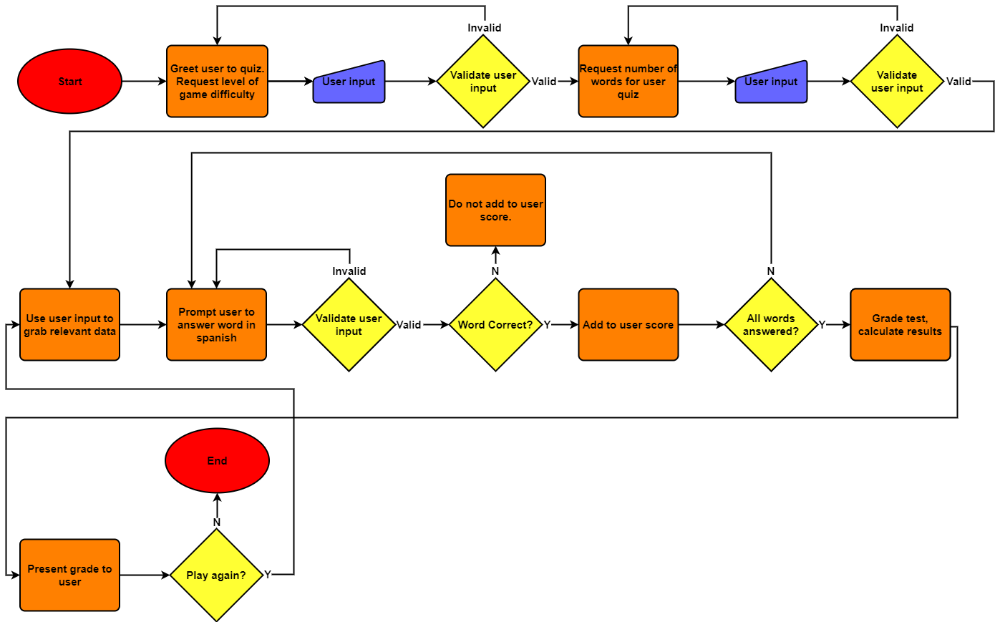

# Spanish quiz
This programme is designed to test a user's level of spanish and to assist them in learning the Spanish language. This quiz is designed not only to grade the user's level of spanish, but also to provide the user with the correct translation of the word once they have guessed, thus helping them to learn more.  
The quiz can be played on an easy, medium or hard level of difficulty to adapt to player's different levels of the language, and there will be a different dictionary of words chosen depending on the user's chosen difficulty.  
The user also has the feature to choose the amount of words to be graded on, with a maximum of 100 words per game.  

The full **[Spanish quiz](<!-- Add Heroku project link here later -->)** game can be played here. Go on, have a go!
# Flow chart
Before beginning the project, a flow chart was designed to visualize the logic behind the programme. The flow chart can be seen below. Please note that this flowchart was made in the initial design process for the project, and some minor changes may be incorporated as the project is being built. One example of this can be seen in requesting the user for their name. This is currently requested in the programme, however it is not present in the flowchart.  

# Features
## Existing Features
 - Name input - Along with the inputs relevant for the quiz, we also request the user's name so that we can refer to them by name, making for a more personalised experience throughout the quiz.
 - User input validation - The programme includes validation checking on all user input entered into the programme. Rather than crashing the programme, the user will receive a relevant error message upon the wrong input being entered, and asked to repeat their input.
 - Difficulties - The programme is designed to be played on either an easy, medium or hard difficulty. This allows for users of various levels of spanish to enjoy and participate in the quiz, thereby increasing accessibility and the target audience of the programme.
<!-- 

Welcome Conor,

This is the Code Institute student template for deploying your third portfolio project, the Python command-line project. The last update to this file was: **August 17, 2021**

## Reminders

* Your code must be placed in the `run.py` file
* Your dependencies must be placed in the `requirements.txt` file
* Do not edit any of the other files or your code may not deploy properly

## Creating the Heroku app

When you create the app, you will need to add two buildpacks from the _Settings_ tab. The ordering is as follows:

1. `heroku/python`
2. `heroku/nodejs`

You must then create a _Config Var_ called `PORT`. Set this to `8000`

If you have credentials, such as in the Love Sandwiches project, you must create another _Config Var_ called `CREDS` and paste the JSON into the value field.

Connect your GitHub repository and deploy as normal.

## Constraints

The deployment terminal is set to 80 columns by 24 rows. That means that each line of text needs to be 80 characters or less otherwise it will be wrapped onto a second line.

-----
Happy coding! -->