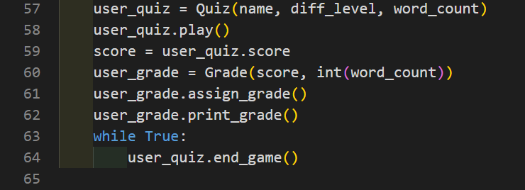

# Spanish quiz
This programme is designed to test a user's level of spanish and to assist them in learning the Spanish language. This quiz is designed not only to grade the user's level of spanish, but also to provide the user with the correct translation of the word once they have guessed, thus helping them to learn more.  
The quiz can be played on an easy, medium or hard level of difficulty to adapt to player's different levels of the language, and there will be a different dictionary of words chosen depending on the user's chosen difficulty.  
The user also has the feature to choose the amount of words to be graded on, with a maximum of 100 words per game.  

The full **[Spanish quiz](https://spanish-quiz.herokuapp.com/)** game can be played here. Go on, have a go!
# Flow chart
Before beginning the project, a flow chart was designed to visualize the logic behind the programme. The flow chart can be seen below. Please note that this flowchart was made in the initial design process for the project, and some minor changes may be incorporated as the project is being built. One example of this can be seen in requesting the user for their name. This is currently requested in the programme, however it is not present in the flowchart.  


# Features
## Existing Features
 - Name input - Along with the inputs relevant for the quiz, we also request the user's name so that we can refer to them by name, making for a more personalised experience throughout the quiz.
 - User input validation - The programme includes validation checking on all user input entered into the programme. Rather than crashing the programme, the user will receive a relevant error message upon the wrong input being entered, and asked to repeat their input.
 - Difficulties - The programme is designed to be played on either an easy, medium or hard difficulty. This allows for users of various levels of spanish to enjoy and participate in the quiz, thereby increasing accessibility and the target audience of the programme.
 - Score - During the game, the user's score is tracked. This is used to calculate how many questions the user has gotten correct, and how many they have gotten incorrect. It is also later used to find out the user's percentage of right/wrong answers.
 - Grading - At the end of the game, the user will be given a grade based on how well they have done (based off the irish grading system e.g. B1, B2, A1 etc.), along with a comment which is relevant to their grade. Other statistics include a percentage of the user's correct/incorrect answers, how many correct and incorrect answers the user has inputted, and the total amount of words that they have been tested on.
 - Object oriented programming (OOP) - This project was created using the OOP methodology. Because of this, the code should have increased readibility and be easier to add new features and maintain in the future, and will also be advantageous to others who may wish to update/edit/study the programme.
 - Automatic clearing of terminal - A method was created to automatically clear the user terminal at various stages throughout the script. This makes the programme more readable and aesthetic for the user, as there is only a little bit of new information to be processed as opposed to lots of information, most of which the user will have read already.
 - Play again, restart or exit - When the user has completed their quiz, they then have 3 options to pick from - They can either choose to replay the quiz with the same settings (Same name, number of words and difficulty), restart the game to play with different settings, or exit the game entirely.

## Future features
 - English to Spanish questions - In the future, a feature may be added to allow the user to be tested on words in English, and attempt to provide a translation of the word in to Spanish.
 - Saving grades - A feature may be added to allow the user to save the grade in the form of a .txt document. This feature simply involves asking the user if they would like to save their grade, along with all their statistics about how they have done on the quiz. If the user wants, a .txt document would be written up outlining the user's grade and quiz results, and be saved on to the user's device.
 - Phrases - Currently, the dictionaries used to hold the words simply hold the spanish word as a key, and the english translation as the value. However, a feature may later be added to this programme whereby a second key is added to each of these dictionaries called "phrase" which would give an example of how the word is used in a Spanish sentence once the user has attempted their answer. This would help the user to learn more, as it would not only provide a phrase for the user and in turn more Spanish vocabulary, but would also help with grammar and allow the user to better understand the context of where the word is typically used.
 - Grammar/Vocabulary/Verbs modes - To better target a user's particular area of learning, it may be a good idea to provide different modes in which the quiz could be run. This would involve creating 3 separate dictionaries for each type of mode (one for easy, medium and hard) and then inputting the correct words(grammar, vocabulary or verbs) into the appropriate dictionaries depending on their degree of difficulty.

# Data model
I decided to create this programme with an Object Orientated Programming (OOP) methodology. The programme uses the inputs provided by the user (specifically the user's name, chosen difficulty level and number of words for their quiz) to create an object declared as ```user_quiz``` from the ```Quiz``` class. This class is located in the python file ```quiz_class.py```, and contains the relevant methods used to run the quiz from start to finish. Once the user has answered their requested number of words in the quiz, another object is created and declared as ```user_grade```. This object is made from the Grade class which takes one parameter of the user's score, and another parameter of the user's requested number of words for their quiz. It is located in ```grade_class.py```, and contains all methods which are related to the user's obtained grade at the end of the quiz. Objects from the ```Quiz``` class and ```Grade``` class are created in the ```run.py``` file. Images from both the ```Quiz``` class and ```Grade``` class can be seen below, as well as the ```user_quiz``` and ```user_grade``` objects being created in ```run.py```.
### images
#### quiz_class.py
  
#### grade_class.py
  
#### run.py


# Local deployment
## Deployment
Code Institute has provided a [template](https://github.com/Code-Institute-Org/python-essentials-template) to display the terminal view of this backend application in a modern web browser. This is to improve the accessibility of the project to others.

The live deployed application can be found at [spanish-quiz](https://spanish-quiz.herokuapp.com/).
​
### Local Deployment
​
*Gitpod* IDE was used to write the code for this project.
​
To make a local copy of this repository, you can clone the project by typing the follow into your IDE terminal:
- `git clone https://github.com/my-spanish-quiz.git`  
​
Alternatively, if using Gitpod, you can click below to create your own workspace using this repository.  
​
[](https://gitpod.io/#https://github.com/my-spanish-quiz)
### Heroku Deployment
​
This project uses [Heroku](https://www.heroku.com), a platform as a service (PaaS) that enables developers to build, run, and operate applications entirely in the cloud.
​
Deployment steps are as follows, after account setup:
​
- Select *New* in the top-right corner of your Heroku Dashboard, and select *Create new app* from the dropdown menu.
- Your app name must be unique, and then choose a region closest to you (EU or USA), and finally, select *Create App*.
- From the new app *Settings*, click *Reveal Config Vars*, and set the value of KEY to `PORT`, and the value to `8000` then select *add*.
- Further down, to support dependencies, select *Add Buildpack*.
- The order of the buildpacks is important, select `Python` first, then `Node.js` second. (if they are not in this order, you can drag them to rearrange them)
​
Heroku needs two additional files in order to deploy properly.
- requirements.txt
- Procfile
​
You can install this project's requirements (where applicable) using: `pip3 install -r requirements.txt`. If you have your own packages that have been installed, then the requirements file needs updated using: `pip3 freeze --local > requirements.txt`
​
The Procfile can be created with the following command: `echo web: node index.js > Procfile`
​
For Heroku deployment, follow these steps to connect your GitHub repository to the newly created app:
​
- In the Terminal/CLI, connect to Heroku using this command: `heroku login -i`
- Set the remote for Heroku: `heroku git:remote -a <app_name>` (replace app_name with your app, without the angle-brackets)
- After performing the standard Git `add`, `commit`, and `push` to GitHub, you can now type: `git push heroku main`
​
The frontend terminal should now be connected and deployed to Heroku.

# Testing and bugs
For all testing, please refer to the [TESTING.md](TESTING.md) file.

# Credits
## Content
The sources below were used when trying to solve intricate problems within the programme and played a solid role in helping me to build this project.
  - [W3schools](https://www.w3schools.com/) was used as a learning resource and helped me to learn more about various python functions and concepts, and also aided in learning about the syntax of the language
  - Corey Schafer's [Youtube channel](https://www.youtube.com/channel/UCCezIgC97PvUuR4_gbFUs5g) was instrumental in assisting me when working with python functions, and how to apply them to my programme.
  - [Stack Overflow](https://stackoverflow.com/) was used as a learning resource and helped me with any questions I had whilst building the project.
  - [draw.io](https://drawio-app.com/) helped me to design the flowchart for the project.
  - [Spanish Academy](https://www.spanish.academy/blog/1000-most-common-spanish-words-for-beginners/) Helped me with findin suitable words for the project. Though it mentions that the words used are for beginners, I believed that this was a good selection of words for both intermediate and advanced levels also. Please note that some words were modified/altered to reflect a more accurate translation to english.

## Acknowledgements
I want to thank the following people and companies for their help in providing solid technical support whilst developing this project.
  - Tim Nelson (Code Institute mentor).
  - [Code Institute](https://codeinstitute.net/ie/).
