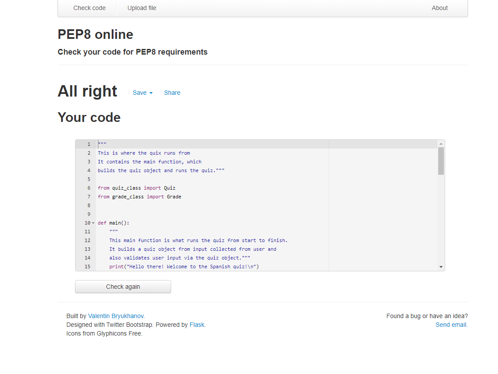
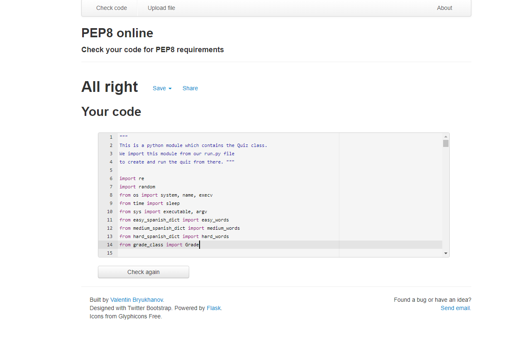
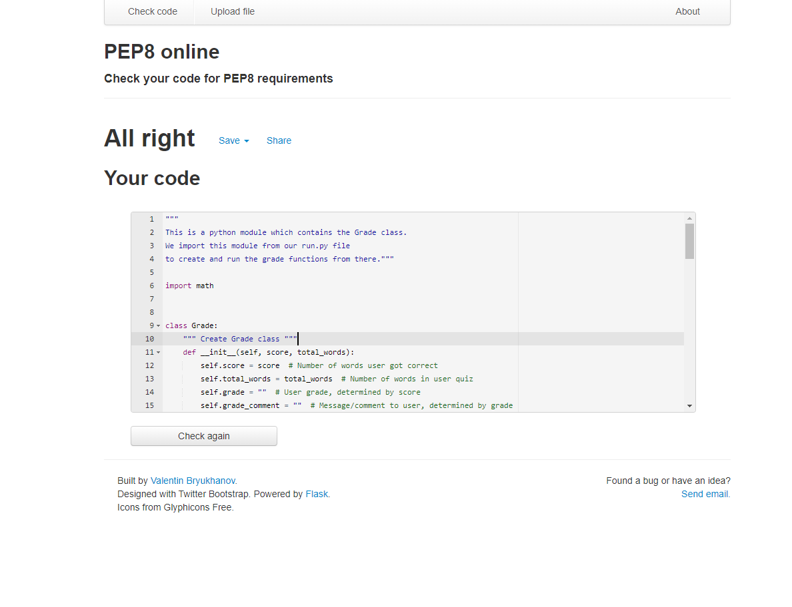

# Browser Compatability
Whilst testing how the programme ran in Heroku and on different browsers, including Firefox, Google Chrome and Microsoft Edge, no browser-specific issues were found. However, a bug was found which was specific to Heroku. An exit feature was originally put into the quiz, which allowed the user to close the programme when finished the quiz. Whilst this ran perfectly on the terminal in the gitpod IDE, this was unfortunately causing a crash in Heroku. As a result, this feature was removed.

# Testing and identified bugs
The following tools and technologies were used to test and debug this project:
## **PEP8online.com**
The official PEP8 online validator was used on all python files within the project to validate the code and to confirm that there were no errors made during development. 
### run.py
Whilst testing on run.py, no validation errors were found. Please see below for the testing screenshot.
#### **Images**  
  
### quiz_class.py
Whilst testing on quiz_class.py, no validation errors were found. Please see below for the testing screenshot.
#### **Images**  
  
  ### grade_class.py
Whilst testing on grade_class.py, no validation errors were found. Please see below for the testing screenshot.
#### **Images**  
  

