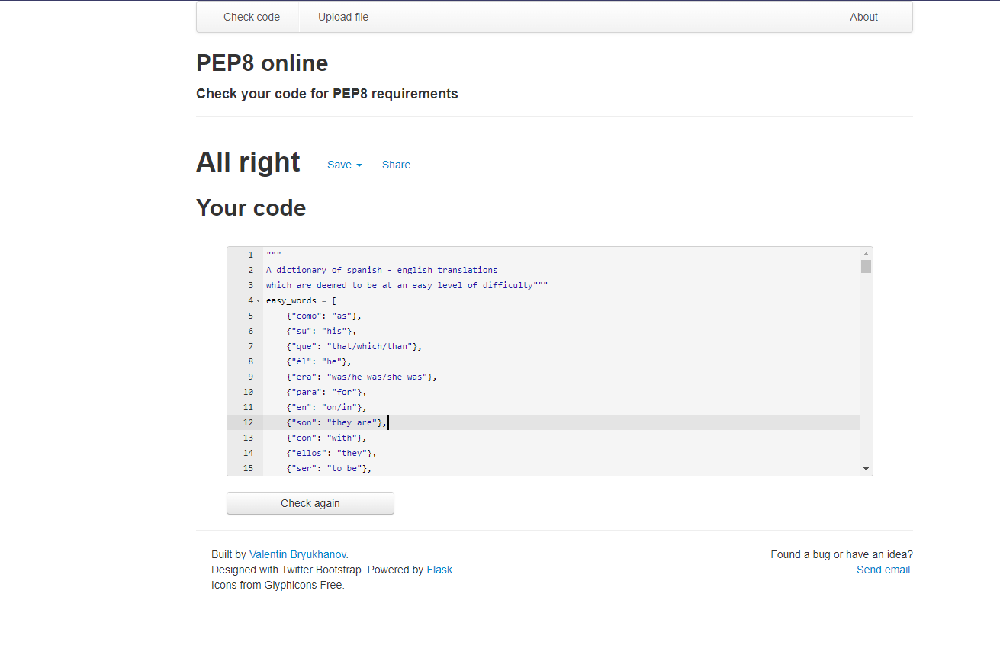
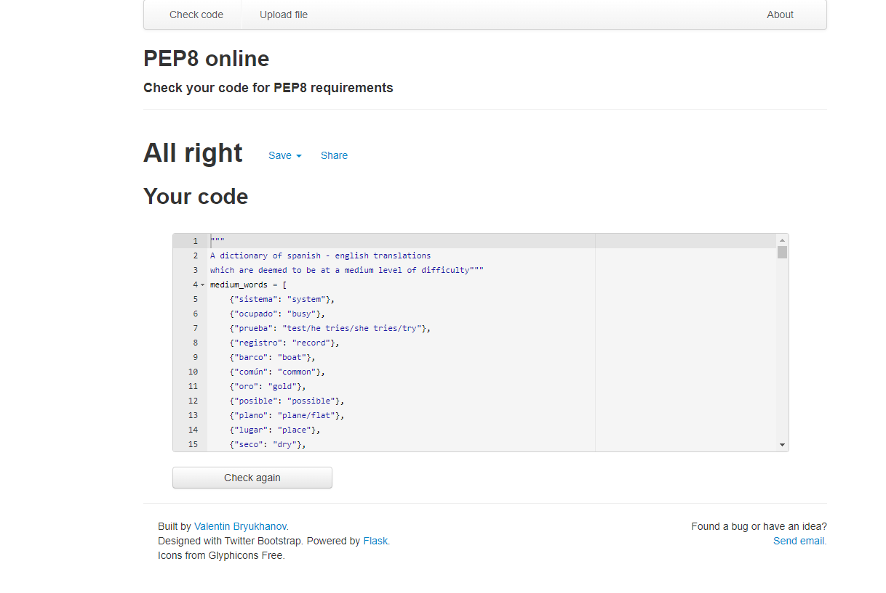
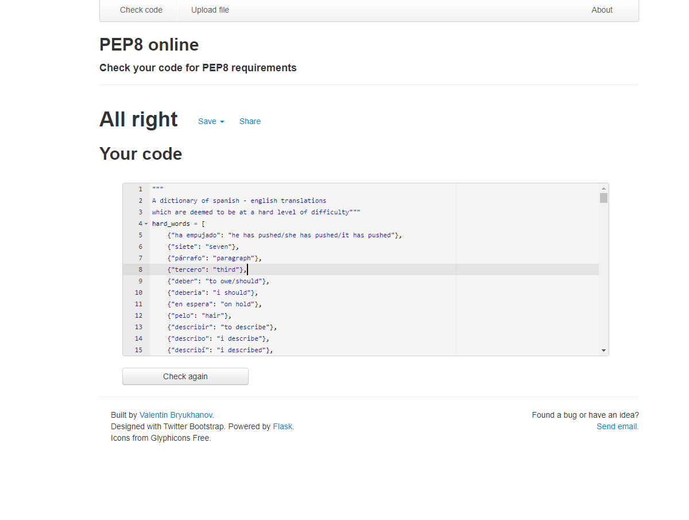

# Browser Compatability
Whilst testing how the programme ran in Heroku and on different browsers, including Firefox, Google Chrome and Microsoft Edge, no browser-specific issues were found. However, a bug was found which was specific to Heroku. An exit feature was originally put into the quiz, which allowed the user to close the programme when finished the quiz. Whilst this ran perfectly on the terminal in the gitpod IDE, this was unfortunately causing a crash in Heroku. As a result, this feature was removed.

# Testing and identified bugs
The following tools and technologies were used to test and debug this project:
## **PEP8online.com**
The official PEP8 online validator was used on all python files within the project to validate the code and to confirm that there were no errors made during development. 
### run.py
Whilst testing on run.py, no validation errors were found. Please see below for the testing screenshot.
#### **Images**  
  
### quiz_class.py
Whilst testing on quiz_class.py, no validation errors were found. Please see below for the testing screenshot.
#### **Images**  
  
### grade_class.py
Whilst testing on grade_class.py, no validation errors were found. Please see below for the testing screenshot.
#### **Images**  
  
### easy_spanish_dict.py
Whilst testing on easy_spanish_dict.py, no validation errors were found. Please see below for the testing screenshot.
#### **Images**  
  
### medium_spanish_dict.py
Whilst testing on medium_spanish_dict.py, no validation errors were found. Please see below for the testing screenshot.
#### **Images**  
  
### hard_spanish_dict.py
Whilst testing on hard_spanish_dict.py, no validation errors were found. Please see below for the testing screenshot.
#### **Images**  
  

# Unfixed bugs
During testing of the programme, purposeful attempts were made to break the game and cause crashes to the programme. One particular bug was found which crashed the programme during this testing method, however it unfortunately could not be replicated and the cause is currently unknown. A screenshot of the attached crash is below. It is believed that the bug may be asynchronous in nature, and that the programme called ```user_quiz.play``` in ```run.py``` before the dictionary ```quiz_words``` was declared within the ```if``` statement in ```quiz_class.py```. There are two current predictions as to why this occured.
 - The ```if``` statement (currently beginning on line 135 in ```quiz_class.py```) didn't meet the relevant conditions to declare ```quiz_words```.
 - The ```while``` loop (currently beginning on line 32 in ```run.py```) broke too soon, and went on to ask the user for the number of words needed, and then once the user has entered that, ```user_quiz.play``` was called (currently beginning on line 58 in ```run.py```).

# Fixed bugs
During the programme, one particular bug occurred whilst using regular expressions to test if a user's input was correct. The programme would mostly work, however failed on special characters. This bug was caused by the arguments for the function ```re.search``` (currently beginning on line 59 in ```quiz_class.py```) being in the wrong positions. Once this was fixed, the regular expression worked as expected.